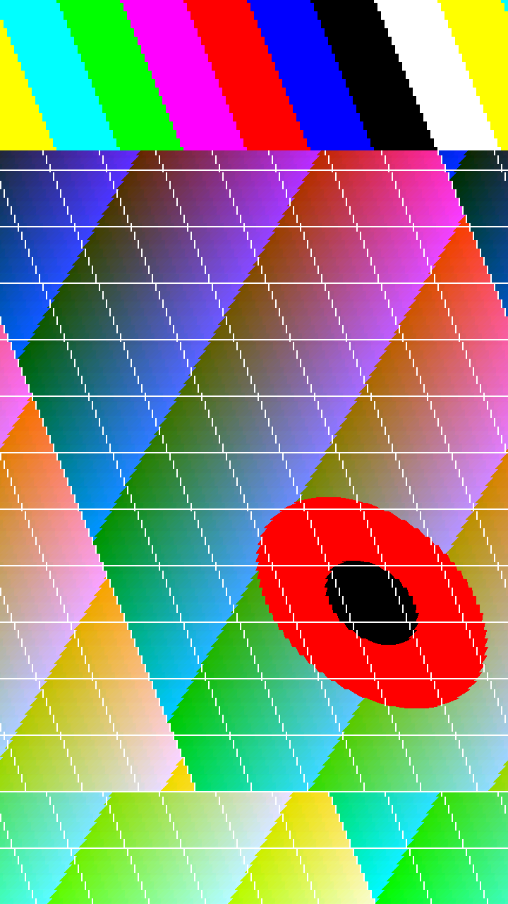

# glitchESP

[](https://github.com/koupypavel/glitchESP/actions/workflows/firmware.yml)
[](https://github.com/koupypavel/glitchESP/releases/latest)
[](LICENSE)

A handheld glitch-art camera built on the Waveshare **ESP32-P4-WIFI6-Touch-LCD-5**: a 5-inch
720×1280 touch display, an OV5647 MIPI-CSI camera and a microSD slot. The preview is glitched
live, the shutter burns the effect into the saved photo or video, and every shot gets a small
"recipe" file so its look can be reproduced.

| Channel shift | Kaleido | Drift | Diffraction |
|---|---|---|---|
|  |  |  |  |

| VHS | Databend | Slit scan | Squint |
|---|---|---|---|
|  |  |  |  |

*Effects rendered by the PC harness on synthetic test scenes.*

## What it does

- **Live preview** at about 20 fps (10 to 18 fps with effects, depending on the chain), with
  up to three effects chained. Sixteen effects so far:
  channel shift, scanline smear, bit crush, blocks, wave, pixel sort, tracers, hue drift,
  kaleido, diffraction, drift, breathe, VHS, slit scan, databend and squint (a painter's
  squint: blur away the detail, keep the big shapes of light and shadow).
- **One knob for "how broken".** An amount slider drives every active effect through its own
  mapping; a seed button re-rolls the randomness. Every parameter can also be set by hand.
- **Photos**: hardware JPEG saved as `GLITCH/IMG_nnnn.jpg` with a `.json` sidecar listing
  the effect chain, parameters, seed and frame number. At 1× zoom the sensor is re-read at
  full resolution for the shot and the effects are applied again at that size: 1088×1920
  (2.1 MP), about 0.7 s per photo. Zoomed in, the 720×1280 frame on screen is saved.
- **Burst**: 3, 5 or 10 photos per press, each with a new random seed, so one press gives
  several variations of the same look.
- **Video** recorded from the same frames you see, in one of two formats: Motion-JPEG AVI
  (`GLITCH/VID_nnnn.avi`, every preview frame, about 2 MB/s, plays in the gallery) or
  H.264 MP4 (`VID_nnnn.mp4`, about six times smaller, 7 to 9 fps, plays on a computer).
- **Zoom** from 1× to 6×. 1× uses the sensor's 2×2 binned mode (widest view, least noise),
  1.5× shows sensor pixels one to one, beyond that the picture is enlarged digitally.
- **Presets**: eight slots for effect recipes (effects, amount, seed), stored in flash;
  four starter looks are filled in on first boot.
- **Gallery**: browse the photos and play the videos on the card, delete them, or take the
  look of any picture back into the camera ("Use look" reads its recipe sidecar).
- **Sounds**: a shutter click and recording beeps through the board's speaker connector.
- **Settings** for mirror, flip, photo size, idle dimming, sound, burst, video format and
  preview quality, stored in flash. The panel also shows the firmware version.

## Controls

| Input | Action |
|---|---|
| Effect chips (bottom bar) | Toggle an effect; up to three run in order |
| Handle (tab above the bar) | Hide the controls (bar, status line, zoom) for a clear view, or bring them back; remembered |
| Amount slider | Intensity of all active effects |
| Edit button (pencil) | A slider or switch for every parameter of each active effect, with a reset |
| Seed button (arrows) | New random seed |
| Presets button (list) | Eight slots: the disk icon stores the current look, tapping a row recalls it |
| Gallery button (picture) | Browse with the arrows or by swiping; play, "Use look", delete (tap twice), close |
| + / − (right edge) | Zoom in and out |
| Gear button | Settings: mirror, flip, full-resolution photos, idle dimming, shutter sound, burst, video format, preview quality |
| BOOT button, short press | Take a photo, or a burst if one is set (in the gallery: back to the camera) |
| BOOT button, hold 0.7 s | Start or stop video recording |

### Optional wired controls

Buttons and a rotary encoder can be wired to the 40-pin header. Every input has a pull-up
and switches to ground, so nothing needs to be connected for the camera to work. Check the
header's orientation against the board's silkscreen before wiring.

| Control | GPIO | Header pin | Action |
|---|---|---|---|
| Shutter button | 21 | 15 (ground: 13) | Click = photo, hold = video, as BOOT |
| Re-roll button | 22 | 17 (ground: 19) | New random seed |
| Encoder A / B | 29 / 30 | 20 / 22 (common to ground: 26) | Amount knob; in the gallery, previous / next |
| Encoder push | 31 | 24 | Click = next preset (in the gallery: play), hold = hide / show the controls |

These are implemented but have not been tried with real switches yet.

## Hardware

- Waveshare ESP32-P4-WIFI6-Touch-LCD-5 (ESP32-P4, 32 MB PSRAM, 32 MB flash).
- OV5647 camera module on the MIPI-CSI connector (sold separately).
- A microSD card (FAT32) for photos and video.

Developed and tested on ESP32-P4 silicon **revision v1.3**. Revision 3.x boards need the
`rev3_x` build profile and have not been tested.

## Install a release

Each [release](https://github.com/koupypavel/glitchESP/releases) carries images built for
the tested board (ESP32-P4 revision v1.x). You need Python with esptool (`pip install
esptool`) and the board connected through its USB-UART port; replace `COM10` with your port
(`/dev/ttyUSB0`, `/dev/cu.usbserial-...`).

A first install, from the single merged image (this also clears the settings and presets
stored in flash):

```bash
python -m esptool --chip esp32p4 -p COM10 -b 460800 write_flash 0x0 glitchesp-v0.1.0-rev1_3-merged.bin
```

An update that keeps settings and presets: unpack `glitchesp-v0.1.0-rev1_3-parts.zip` and
run this inside the unpacked folder:

```bash
python -m esptool --chip esp32p4 -p COM10 -b 460800 write_flash @flash_args
```

## Enclosure

[`hardware/enclosure`](hardware/enclosure) has a printable case with a battery bay, a
speaker pocket, openings for every port and button, a shutter switch, a rotary encoder,
a tripod thread and an adjustable lens hood, as STL files and as the CadQuery script that
generates them. The first version has been printed and fitted; the current one (version 4)
has a bigger speaker pocket, a tactile-switch shutter on the left side and the tripod
mount.


## Build and flash

You need ESP-IDF **v5.5.5**. On Windows, from `firmware/`:

```powershell
.\build.ps1              # build (rev1_3 profile)
.\build.ps1 COM10        # build and flash over the USB-UART port
```

On Linux and macOS, with the ESP-IDF environment active:

```bash
./build.sh                # build
./build.sh /dev/ttyUSB0   # build and flash
```

The component versions are pinned in `firmware/dependencies.lock`, and the GitHub workflow
in `.github/workflows/firmware.yml` builds every push the same way.

Details, the module layout and design notes are in [`firmware/README.md`](firmware/README.md).

## Developing effects

Effects are plain C with no ESP-IDF dependency, so the same files run on a PC in
milliseconds. [`tools/fxlab`](tools/fxlab) builds them into a small command-line tool:

```powershell
tools\fxlab\build.ps1
tools\fxlab\out\fxlab.exe --list
tools\fxlab\out\fxlab.exe in.ppm out.ppm --amount 0.6 chanshift scanline
```

(`tools/fxlab/build.sh` does the same with gcc or clang.)

[`docs/EFFECTS.md`](docs/EFFECTS.md) explains the engine, each effect, how to add one, and
what was learned about performance on the ESP32-P4.

## Repository layout

| Path | Contents |
|---|---|
| `firmware/` | The ESP-IDF project |
| `tools/fxlab/` | PC harness for the effect code, with sample renders |
| `docs/EFFECTS.md` | Effect engine guide and measured performance model |
| `CHANGELOG.md` | What each release contains |
| `.github/workflows/` | Build of the firmware and the harness on every push; releases on a version tag |
| `hardware/enclosure/` | Printable case: STL files, the CadQuery model that makes them, assembly notes |
| `PLAN.md` | Original plan, hardware facts and research notes |
| `m0/` | Hardware bring-up notes and the two stock examples used for it |
| `doc/` | Board schematic and pointers to vendor documentation |

## Status

Working on the device (ESP32-P4 revision v1.3): preview, all sixteen effects on both cores,
parameter editing, presets, zoom, settings, photos (including full-resolution stills and
bursts), video (Motion-JPEG and H.264) saved to the card, and the gallery.

## To do

Waiting for hardware or a test:

- [ ] Battery indicator (the board measures the battery on GPIO20; no battery here yet)
- [ ] Try the wired controls on the header with real switches and an encoder
- [ ] Build and try the `rev3_x` profile on a revision 3.x board; add it to the workflow
- [ ] Flash the single merged release image to a board (so far it has only been compared,
      byte for byte, with the three images the normal flash writes)

Camera:

- [ ] Reorder the effect chain on screen (effects now always run in the order of the chips)
- [ ] More than one history effect at a time (tracers and slit scan share one buffer)
- [ ] A clean, unglitched copy next to each photo, as an option
- [ ] Larger stills: the ISP takes at most 1920 pixels per line, so the full 5 MP frame
      would need RAW capture and demosaicing in software
- [ ] Drawing the control bar costs about 4 fps while it is shown; stamp only what changed

Effects:

- [ ] Feedback (zoom and rotate the previous frame into the next)
- [ ] ISP glitches (colour matrix, gamma and hue of the image processor pushed out of range)
- [ ] Haze / glow, radial block displacement, melting (see the end of section 6 in
      `docs/EFFECTS.md`)
- [ ] Datamosh on the H.264 stream (dropped key frames)

Video and gallery:

- [ ] Faster H.264: the RGB to YUV conversion takes 60 to 70 ms per frame and limits it to
      7 to 9 fps
- [ ] Sound in videos (the board has a microphone input)
- [ ] Play H.264 recordings in the gallery (there is no hardware decoder)
- [ ] Thumbnail grid in the gallery

Connectivity:

- [ ] USB mass-storage mode, so the card shows up on a PC over the OTG port
- [ ] Wi-Fi gallery or transfer through the board's ESP32-C6

Project:

- [ ] Photos and a video from the device in this README (the samples above are PC renders)
- [ ] Print and fit version 4 of the enclosure in [`hardware/enclosure`](hardware/enclosure)
      (version 1 fitted except the speaker); lanyard eye

## License

MIT, see [`LICENSE`](LICENSE). Third-party material and the components fetched at build time
are listed in [`THIRD_PARTY_NOTICES.md`](THIRD_PARTY_NOTICES.md). Contributions are welcome:
see [`CONTRIBUTING.md`](CONTRIBUTING.md).

This project is not affiliated with Espressif Systems or Waveshare.
