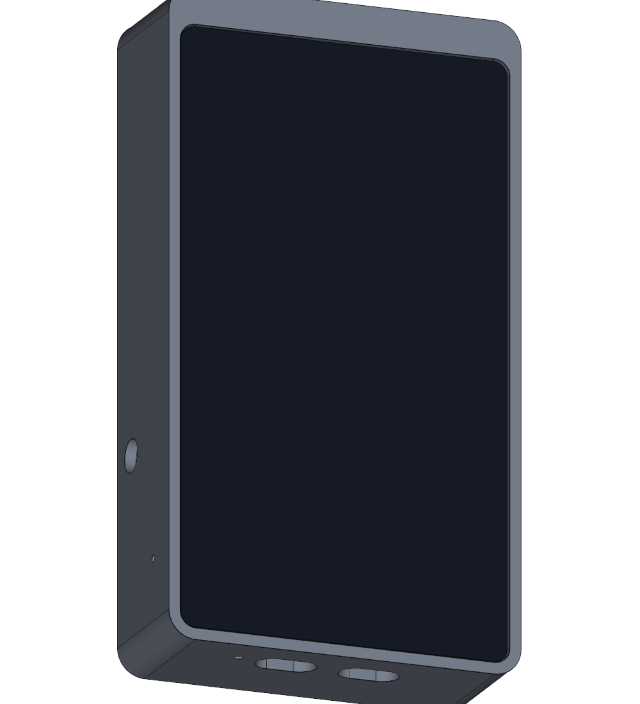
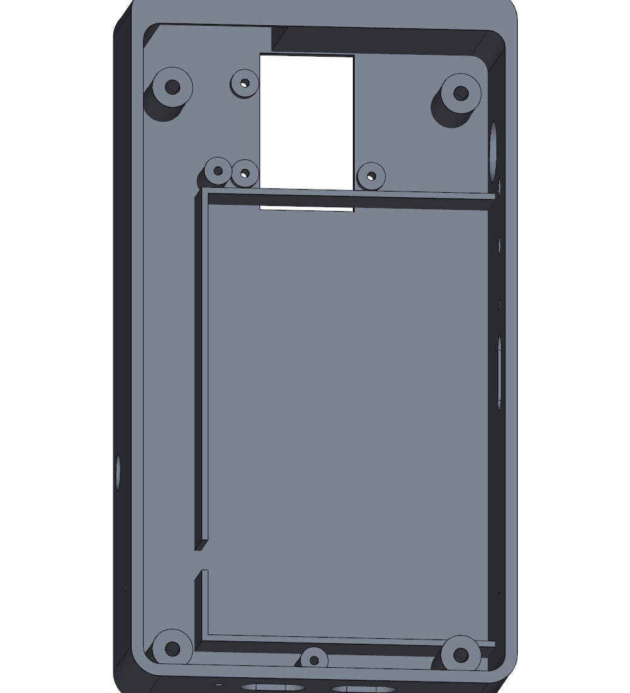
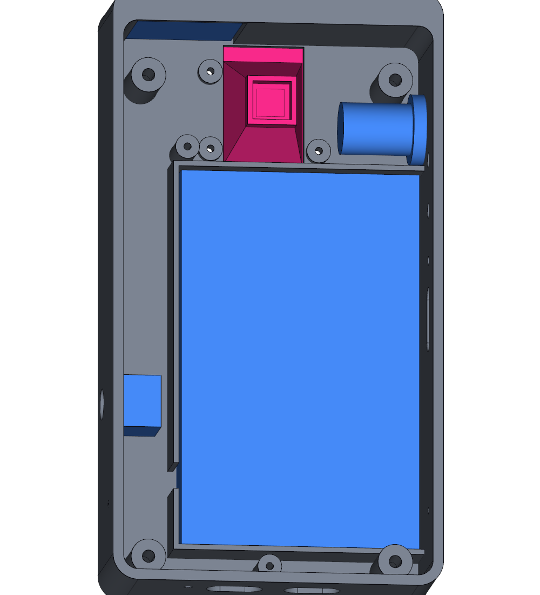
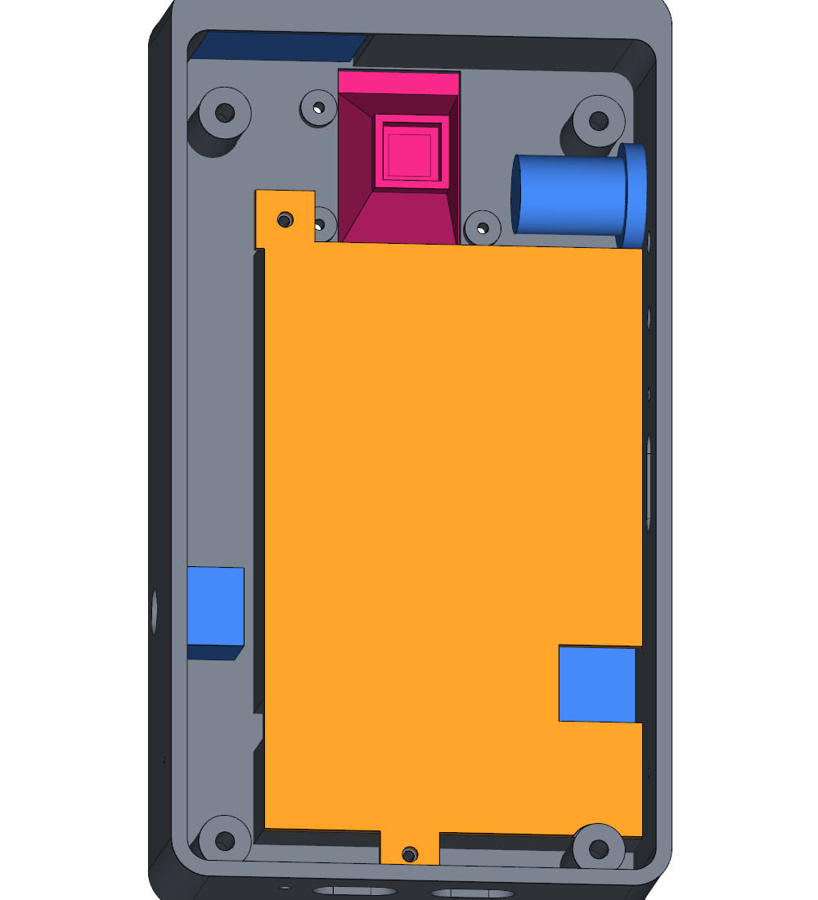
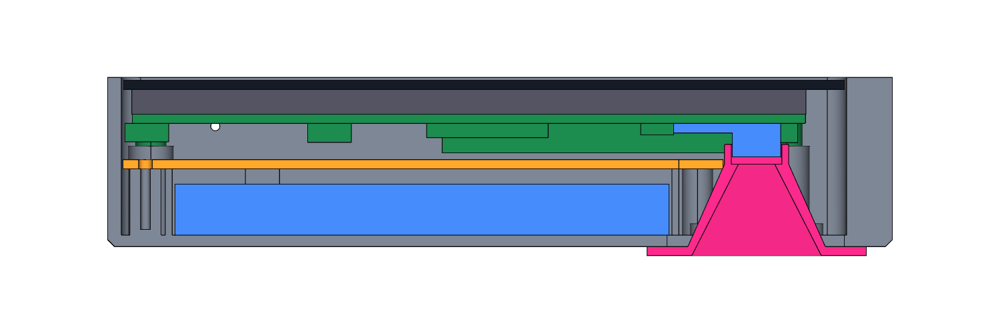

# Enclosure

A printable case for the glitchESP camera: the Waveshare ESP32-P4-WIFI6-Touch-LCD-5 with its
kit camera, a flat LiPo cell, a small speaker, a shutter button and a rotary encoder.

**Version 2, not printed yet.** Version 1 was printed: the display unit, the openings, the
buttons, the screws, the lens hood and the battery plate fitted, but the speaker (26 × 26 ×
5 mm) did not, and the shutter button was moved from the top edge to the right side. Version
2 changes the body (2.2 mm thicker, speaker pocket, shutter hole), the battery plate (one
screw moved) and the lens hood (taller, for the thicker back); the plungers are unchanged.
Each version is checked in software: no part overlaps the board's 3D model or the parts you
add, every opening is clear, and the STL files are closed meshes. Sizes of the parts the
board model does not contain are estimates; they are listed under
[What to check before printing](#what-to-check-before-printing).

| Front | Back |
|---|---|
|  |  |

| Body, empty | With battery, speaker, button, encoder | Battery plate on |
|---|---|---|
|  |  |  |

Cut through the lens (front of the camera is up, top of the camera is right):



## The design

- **Size:** 76.3 × 138.2 × 29.8 mm, plus 1.6 mm where the lens hood sits on the back.
- **Body:** one tub, printed back-down, no supports. The display unit drops in from the
  front; the glass is surrounded by a rim that stands 0.5 mm proud. Four M2.5 screws go
  through the back into the board's own standoffs, which is how the board is meant to be
  mounted (nothing presses on the glass).
- **Bottom edge:** two USB-C openings, sized for the plug's moulding, and a hole for the
  power LED.
- **Right edge:** the shutter button (12.2 mm hole) near the top, where the index finger
  rests when you hold the camera; below it printed plungers for the board's POWER and
  BOOT buttons, a pin hole for RESET, the microSD slot with a finger scoop.
- **Left edge:** rotary encoder (7.2 mm hole for an EC11).
- **Top:** an 8 mm "forehead" above the glass with a pocket on the left for the speaker,
  which stands on edge against the top wall and plays through a grille. The speaker's
  26 mm height is what sets the depth of the case.
- **Back:** the lens hood. The kit camera lies loose on the board on a short cable, so the
  hood reaches in, holds the lens block in a square socket and can slide ±3.5 mm before
  its three screws are tightened. Its opening widens with the camera's field of view.
- **Inside, behind the board:** a battery bay of 56.8 × 88 × 9.5 mm with a cover plate
  that keeps the cell away from the board's solder joints, and a channel over the 40-pin
  header for the control wiring.

## Files

| File | Print | Notes |
|---|---|---|
| `stl/body.stl` | 1× | Back on the bed, as exported. No supports. |
| `stl/battery_plate.stl` | 1× | Flat. |
| `stl/lens_hood.stl` | 1× | Flange on the bed, as exported. |
| `stl/button_plunger.stl` | 2× | Standing on its wide end, as exported. |
| `stl/fit_test.stl` | optional | The front 15 mm of the body with a thin floor, about half the plastic. Print it first to check the fit of the glass and the openings. Do not screw the board into it. |
| `step/enclosure.step` | | All parts in place, with stand-ins for the board and what goes inside, for a CAD program. |
| `enclosure.py` | | The model. Every size is a parameter at the top. |

Suggested settings: PETG or PLA, 0.2 mm layers, 3 perimeters, 20 % infill. The forehead has
a short bridge over the speaker pocket (27 mm); a little sag there is out of sight.

## Parts to buy

| Part | Size | Count |
|---|---|---|
| Screw, pan head | **M2.5 × 12 mm, not longer** | 4 |
| Screw, self-tapping | M2 × 6 mm | 5 |
| Push-button, momentary, panel mount | 12 mm thread, body no wider than 12 mm, at most 19 mm behind the panel | 1 |
| Rotary encoder with switch | EC11, threaded M7 bush, plus a knob | 1 |
| Speaker | 8 Ω 2 W, 26 × 26 × 5 mm, GH1.25 2-pin plug | 1 |
| LiPo cell, 3.7 V, **with protection circuit** | up to 55 × 87 × 9 mm, MX1.25 2-pin plug | 1 |
| Right-angle pin header, 2.54 mm | for pins 13 to 26 of the 40-pin header | 1 |

The M2.5 screws must be 12 mm: the screw head sits 8.5 mm behind the standoff, so a 12 mm
screw ends 2 mm short of the display. A longer one would press into the back of the screen.

## What to check before printing

These are the estimates. Change them at the top of `enclosure.py` and run it again.

| Parameter | Value | How to check |
|---|---|---|
| `LENS_Y` | 48 mm | Lens centre above the middle of the board: plug the camera in, lay it flat, measure from the edge of the CSI connector that the cable leaves (the one nearer the top of the board) to the lens centre and add 33.4. The hood covers 44.5 to 51.5. |
| `LENS_BLOCK`, `LENS_TOP_Z` | 8.5 mm, 5.9 mm above the PCB | Width of the square lens block and its height. The socket takes blocks up to 8.9 mm wide and 4.7 to 7.2 mm tall. |
| `SPEAKER` | 26 × 26 × 5 mm | Width along the top edge, height (front to back), thickness. The pocket is 27.2 × 26.6 × 5.65 mm. A taller speaker makes the case thicker, a thicker one makes it longer. |
| `SHUTTER_HOLE_D`, `SHUTTER_NUT_D`, `SHUTTER_Y` | 12.2, 16.8, 43.2 mm | Thread and nut (across corners) of your button, and its height above the board centre. It sits between the board's POWER button and the top-right standoff, so it can move about ±1 mm. |
| `ENCODER_HOLE_D`, `ENCODER_BODY` | 7.2, 12.6 mm | EC11. Its small locating lug has no slot: snip it off or let the nut hold it. |
| `BATTERY` | 56.75 × 88 × 9 mm | Bay width, bay length, cell thickness. |

The field-of-view angles of the hood (`FOV_HALF_X`, `FOV_HALF_Y`) fit what the firmware uses
of the sensor today: a 9:16 slice. Reading the full 5 MP frame would need a wider hood.

## Assembly

1. Screw the encoder into the left wall and the push-button into the right wall. Solder
   wires to both, about 12 cm long, ending in the right-angle header. The shutter's wires
   run along the top edge of the battery plate to the channel on the left.
2. Put the speaker into its pocket, face to the grille, and fix it with a strip of
   double-sided tape. Lay the battery into the bay, lead towards the gap in the left rib.
3. Screw the battery plate on (two M2 screws: one at the bottom edge, one left of the
   lens).
4. Drop the two plungers into their holes from inside, wide end in.
5. Hold the display unit above the body and plug in the battery (check the polarity
   first, see below), the speaker and the header. Lower the unit, glass last, while
   keeping the plungers pushed outwards. The wires go into the channel on the left.
6. Fasten the unit from the back with the four M2.5 × 12 screws. Do not overtighten.
7. Through the opening in the back, move the lens under the middle of the opening. Push
   the hood in so that its socket takes the lens block, check the picture, then tighten
   its three M2 screws.

Wiring to the 40-pin header (the firmware pulls every input up; each switches to ground):

| Control | Header pin | Ground |
|---|---|---|
| Shutter button | 15 (GPIO21) | 13 |
| Encoder A / B | 20 / 22 (GPIO29 / 30) | 26 (common) |
| Encoder push | 24 (GPIO31) | 26 |

**Battery polarity:** LiPo cells are sold with either polarity on the same plug. Compare
the red wire with the `+` mark next to the board's BAT connector before plugging in; a
reversed cell can destroy the charger.

## Known compromises

- The hood stands 1.6 mm proud of the back, so the camera does not lie flat. Two
  stick-on rubber feet near the bottom edge fix that.
- The microSD card sits about 5 mm inside the wall: push it with a fingernail or a tool.
- The shutter button reaches in under the board's Wi-Fi module. The firmware does not
  use Wi-Fi today; if it ever does, prefer a plastic-bodied button.
- No tripod thread and no lanyard eye yet.

## Rebuilding the files

```bash
python -m venv .venv
.venv/Scripts/python -m pip install cadquery      # Linux, macOS: .venv/bin/python
.venv/Scripts/python enclosure.py                 # STL and STEP, with the checks
.venv/Scripts/python render.py                    # the pictures
```

`enclosure.py` prints the outer size, then two checks: that no printed part overlaps the
board, the parts you add or another printed part, and that a probe passes through every
opening.
